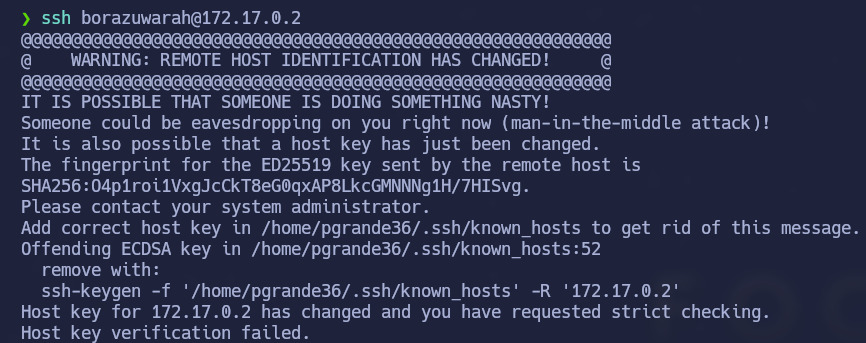

# BorazuwarahCTF

## Índice

- [Enumeration](#enumeration)
- [Gaining Access](#gaining-access)
- [Privilege Escalation](#privilege-escalation)
- [Conclusion](#conclusion)

---

## Enumeration

   1   │ # Nmap 7.94SVN scan initiated Tue Dec 23 17:42:37 2025 as: nmap -sS -p- --open --min-rate 5000 -n -oG scan 172.17.0.2
   2   │ Host: 172.17.0.2 () Status: Up
   3   │ Host: 172.17.0.2 () Ports: 22/open/tcp//ssh///, 80/open/tcp//http///    Ignored State: closed (65533)
   4   │ # Nmap done at Tue Dec 23 17:42:38 2025 -- 1 IP address (1 host up) scanned in 1.31 seconds
───────┴─────────────────────────────────────────────────────────────────────────────

En la código fuente de la url tenemos una imagen. Nos la descargamos con wget

Extraemos información con steghide extract -sf imagen.jpeg

Obtenemos un .txt que nos dice que sigamos buscando en la imagen, por tanto, aplico esta vez strings imagen.jpeg | less  para ver más información y efectivamente nos muestra lo siguiente: 

Nos revela el nombre de usuario pero no la contraseña. Haciendo fuerza bruta a ssh sabiendo el nombre del usuario la obtenemos.
hydra 172.17.0.2 -s 22 ssh -l borazuwarah -P /usr/share/wordlists/rockyou.txt

## Gaining Access

Al intentar acceder a la shell nos muestra lo siguiente:

Borramos lo que dice y nos volvemos a conectar con la password.

## Privilege Escalation

Para convertirnos en root he buscado permisos sudo y he encontrado lo siguiente:

Sencillo, ejecutamos /bin/bash con sudo y ya somos root

## Conclusion

Me ha servido para practicar esteganografía
