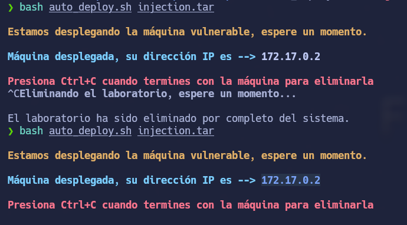
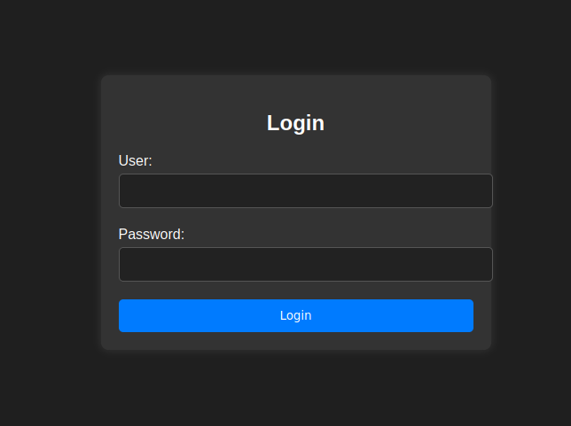
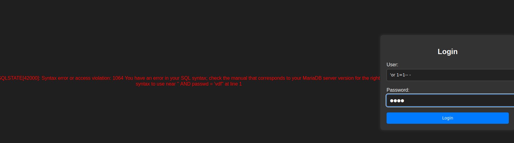
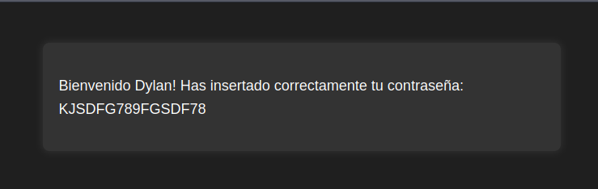
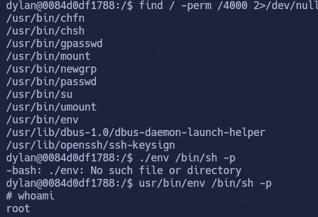

# Injection

## Índice

- [Setup](#setup)
- [Enumeration](#enumeration)
- [Gaining Access](#gaining-access)
- [Privilege Escalation](#privilege-escalation)
- [Conclusion](#conclusion)

---

## Setup

-Para iniciar la máquina nos la descargamos en DockerLabs y obtendremos un .zip
-Lo descomprimimos y ejecutamos con bash los archivos

## Enumeration

Escaneo de puertos abiertos con nmap:

  1   │ # Nmap 7.94SVN scan initiated Tue Dec 23 15:20:55 2025 as: nmap -sS -p- --open --min-rate 5000 -n -oG scan 172.17.0.2
   2   │ Host: 172.17.0.2 () Status: Up
   3   │ Host: 172.17.0.2 () Ports: 22/open/tcp//ssh///, 80/open/tcp//http///    Ignored State: closed (65533)
   4   │ # Nmap done at Tue Dec 23 15:20:56 2025 -- 1 IP address (1 host up) scanned in 1.34 seconds

Escaneo de los puertos abiertos:

 nmap -p22,80 -sCV 172.17.0.2
Starting Nmap 7.94SVN ( https://nmap.org ) at 2025-12-23 17:12 CET
Nmap scan report for 172.17.0.2
Host is up (0.00014s latency).

PORT   STATE SERVICE VERSION
22/tcp open  ssh     OpenSSH 8.9p1 Ubuntu 3ubuntu0.6 (Ubuntu Linux; protocol 2.0)
| ssh-hostkey: 
|   256 72:1f:e1:92:70:3f:21:a2:0a:c6:a6:0e:b8:a2:aa:d5 (ECDSA)
|_  256 8f:3a:cd:fc:03:26:ad:49:4a:6c:a1:89:39:f9:7c:22 (ED25519)
80/tcp open  http    Apache httpd 2.4.52 ((Ubuntu))
|_http-title: Iniciar Sesi\xC3\xB3n
|_http-server-header: Apache/2.4.52 (Ubuntu)
| http-cookie-flags: 
|   /: 
|     PHPSESSID: 
|_      httponly flag not set
Service Info: OS: Linux; CPE: cpe:/o:linux:linux_kernel

Service detection performed. Please report any incorrect results at https://nmap.org/submit/ .
Nmap done: 1 IP address (1 host up) scanned in 6.70 seconds

## Gaining Access

el http nos lleva a un inicio de sesión:

He buscado más directorios pero no he encontrado nada.

Al tener una página de autenticación expuesta, suele ser una superficie típica para:

-Fuerza bruta / credential stuffing
-Usuarios válidos por enumeración
-SQL Injection en login

En este caso como no tenemos nada, he intentado sql injection y he visto que es vulnerable, por tanto, vamos a ejecutar la inyección

-El primer ' cierra la cadena que esperaba el SQL.
-OR 1=1 añade una condición booleana que es siempre verdadera.
-En SQL, si una parte del WHERE es verdadera, toda la condición puede evaluarse como verdadera según la precedencia de operadores.

-Resultado: el filtro deja de depender de usuario y contraseña reales y la consulta devuelve algún registro válido.

-La aplicación interpreta “hay resultados” como login correcto.

-Accedemos a la shell con las credenciales

## Privilege Escalation

-Convertirnos en root ha sido muy sencillo ya que al revisar los permisos SUID he visto uno raro /usr/bin/env 

-Nos vamos a https://gtfobins.github.io/gtfobins/env/ copiamos el comando y nos convertimos en root

## Conclusion

-Primera vez que me toca hacer sql-injection