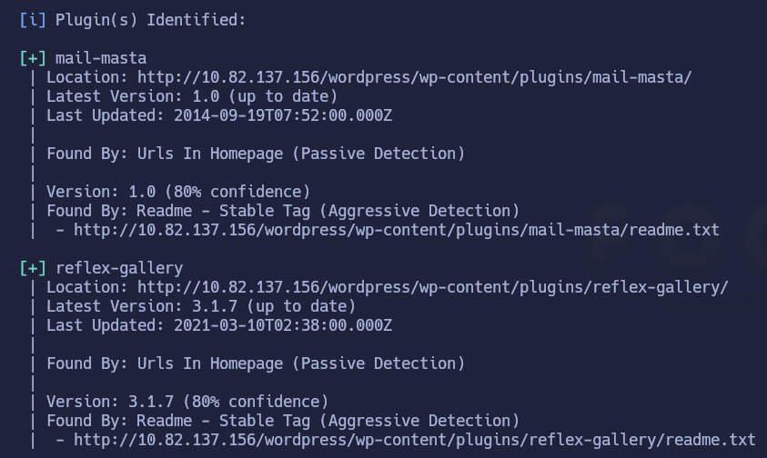
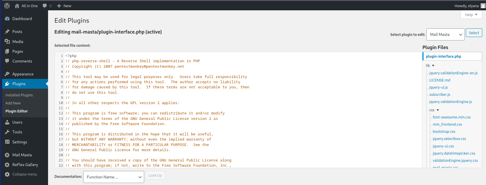
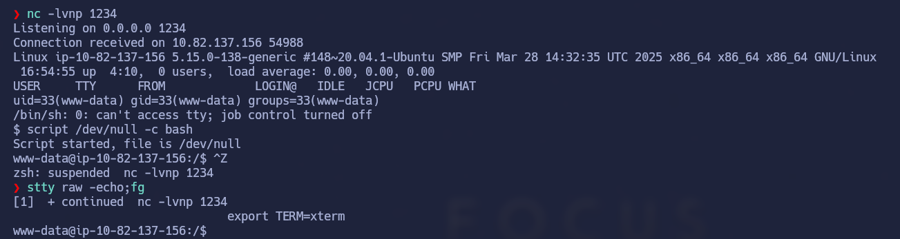

## All_In_One


## Índice

- [Setup](#setup)
- [Enumeration](#enumeration)
- [Gaining Access](#gaining-access)
- [Privilege Escalation](#privilege-escalation)
- [Conclusion](#conclusion)


## Setup

El primer paso es establecer conexión con la VPN de TryHackMe. Usaré openvpn para hacerlo — este es el comando:

```bash
sudo openvpn <vpn descargada de thm>
```

## Enumeration

Lo primero como siempre va a ser realizar un escaneo de posibles puertos abiertos a la máquina víctima. Lo he hecho con `nmap`:

```
Nmap 7.94SVN scan initiated Fri Dec 19 11:14:06 2025 as: nmap -sS -p- --open --min-rate 5000 -n -oG scan 10.82.152.98
Host: 10.82.152.98 ()   Status: Up
Host: 10.82.152.98 ()   Ports: 21/open/tcp//ftp///, 22/open/tcp//ssh///, 80/open/tcp//http///
Nmap done at Fri Dec 19 11:14:20 2025 -- 1 IP address (1 host up) scanned in 14.06 seconds
```

Con `gobuster` hacemos un escaneo de directorios a la url víctima y encontramos:

- /wordpress
- /hackathons

Ahora sabemos que estamos ante un WordPress, por tanto, lo primero que se me ocurre es ver toda la información posible con `wpscan`



He buscado a ver si podía explotar el plugin mail-masta v.1.0 y efectivamente, se puede.

Si ejecutamos el siguiente código (disponible en [este repositorio de GitHub](https://github.com/Hackhoven/wp-mail-masta-exploit/blob/main/mail-masta-exploit.py)) de la siguiente forma:

```bash
python3 exploit.py http://10.82.137.156/wordpress/
```

Conseguimos extraer credenciales del archivo wp-config.php y nos podemos loguear a wordpress como elyana.

> Nota: Hay otras formas de hacerlo. Desde el directorio que encontramos al principio `/hackathons` seguramente también se puede.


## Gaining Access

Para ganar acceso a la shell, basta con acceder a la sección de edición de plugins, seleccionamos el de mail-masta y hacemos lo siguiente:

1. Borramos el código php que está.
2. Nos copiamos nuestro código para la reverse-shell-php (con nuestra ID y PUERTO)
3. Estando en escucha por el puerto que hayamos puesto en paralelo, le damos a update y obtendremos la shell.





## Privilege Escalation

Esta parte ha sido muy sencilla salvo el último detalle, que lo diré al final.

Lo primero que he hecho ha sido ir a por la flag del user.txt pero me salía permiso denegado, por lo que he tenido que elevar privilegios antes de nada.

1. No podía hacer `sudo -l` ni había ningún permiso raro en los SUID.
2. Me ha dado por buscar en los backups y he encontrado lo siguiente:

He observado que es root quien lo ejecuta y puedo realizar cambios siendo www-data, así que abrí el archivo y ejecuté el comando:

```bash
chmod u+s /bin/bash
```

Guardamos, salimos y ejecutamos el script. Vemos que los permisos de `/bin/bash` han cambiado:

```
www-data@ip-10-82-137-156:/var/backups$ ls -la /bin/bash
-rwsr-xr-x 1 root root 1183448 Apr 18  2022 /bin/bash
```

Si hacemos `/bin/bash -p`, somos root.


Ahora viene donde se me ha nublado un poco hasta que he conseguido descubrir las flags correctas.

Al hacer `cat` al user.txt veía lo siguiente: `VEhNezQ5amc2NjZhbGI1ZTc2c2hydXNuNDlqZzY2NmFsYjVlNzZzaHJ1c259`

Y lo mismo con la de root.txt

Resulta que estaba codificado en base64 y había que decodificarlo para ver la flag correctamente. Para la de user.txt era:

```
THM{49jg666alb5e76shrusn49jg666alb5e76shrusn}
```

Lo mismo para la de root.

## Conclusion

Esta máquina ha sido una excelente práctica en explotación de WordPress y escalada de privilegios. Los conceptos clave aprendidos fueron:

- Enumeración efectiva con `nmap` y `gobuster`
- Explotación de plugins vulnerables en WordPress
- Modificación de archivos a través de la interfaz de plugins
- Escalada de privilegios mediante archivos de configuración malconfigurados
- Decodificación de flags en base64
