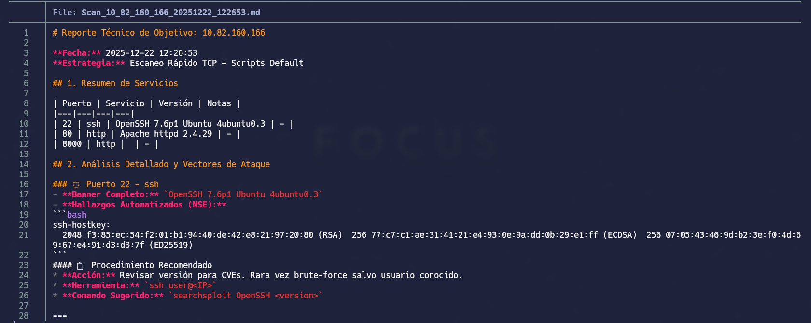
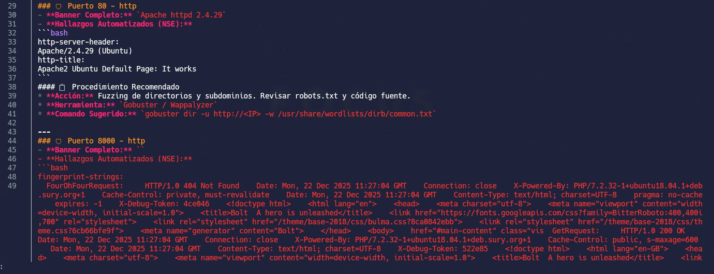
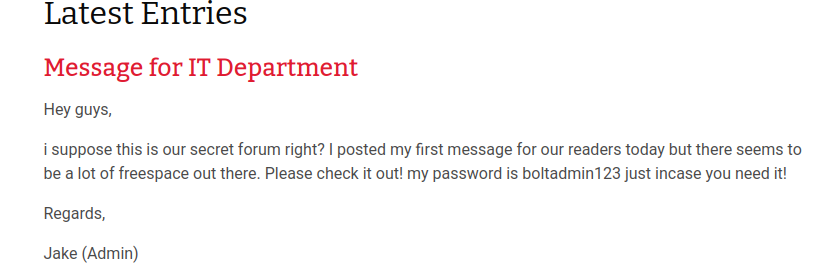
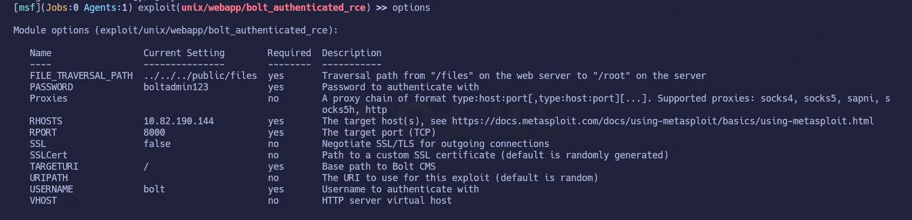

# Bolt

## Índice

- [Setup](#setup)
- [Enumeration](#enumeration)
- [Gaining Access](#gaining-access)
- [Privilege Escalation](#privilege-escalation)
- [Conclusion](#conclusion)

---

## Setup

Conexión a la VPN de TryHackMe con openvpn:

```bash
sudo openvpn thm.ovpn
```

## Enumeration

Esta vez he utilizado un comando que me gustó el reporte que hacía:

https://github.com/danielbarbeytotorres/dscan




Nos vamos a la url por el puerto 8000 y nos encontramos frente a un CMS

El tipo de CMS es Bolt. 
En el siguiente apartado explico como ganar acceso y conseguir la shell

## Gaining Access

En la url encontramos credenciales para loguearnos en el CMS. La pregunta es, cual es la ruta para loguearnos? o para donde son esas credenciales?



Buscando en internet como loguearse a Bolt, he encontrado la ruta por defecto /Bolt/login

Introducimos la credencial con el nombre de usuario. He probado admin y Jake y no era ninguno de los dos. Otro nombre que se me ha ocurrido era bolt, y correcto.

Para obtener acceso a la shell, como en la página de THM de la máquina nos preguntan sobre que nombre tiene el exploit disponible en metasploit, simplemente lo buscamos y lo ejecutamos.

No entro mucho en detalle porque es bastante sencillo



El exploit nos da directamente la posibilidad de ejecución de comandos siendo root.

Ahora simplemente o buscas la flag, o te creas una reverse shell a traves de nc ( que es lo que he hecho yo) para interactuar más comodamente.


## Privilege Escalation

En este caso no hace falta elevar privilegios porque ya obtenemos la shell siendo root

## Conclusion

Máquina sencilla. 

-La única "dificultad" puede que sea encontrar la ruta para loguearse, pero al ser un CMS, se puede encontrar facilmente por internet/enumeración.