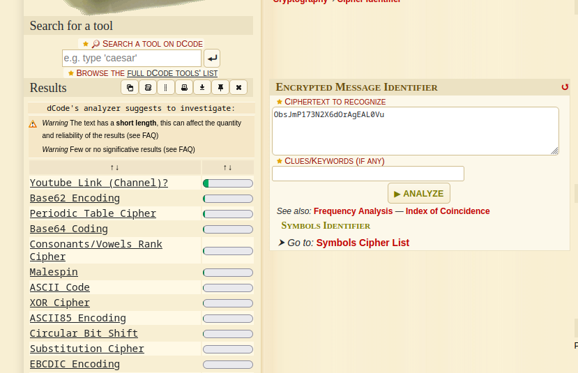
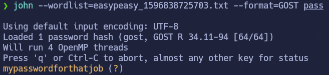

# EasyPeasy

## Índice

- [Setup](#setup)
- [Enumeration](#enumeration)
- [Privilege Escalation](#privilege-escalation)
- [Conclusion](#conclusion)

---

## Setup

El primer paso es establecer conexión con la VPN de TryHackMe. Usaré openvpn para hacerlo — este es el comando:

```bash
sudo openvpn <vpn descargada de thm>
```

Una vez conectados, podemos iniciar la máquina y comenzar con la enumeración.

## Enumeration

Enumeramos puertos abiertos e información sobre estos:

```bash
nmap -sS -p- --open --min-rate 5000 -n -oG scan <MACHINE_IP>
```

Output:

```
Host: <MACHINE_IP>  Status: Up
Ports:80/open/tcp/http, 6498/open/tcp/ssh, 65524/open/tcp/http
```

```bash
nmap -p80,6498,65524 -sCV -oG portScan <MACHINE_IP>
```

Output:

```
Port 80: http/nginx 1.16.1
Port 6498: ssh/OpenSSH 7.6p1 Ubuntu 4ubuntu0.3
Port 65524: http/Apache httpd 2.4.43
```


A continuación, pasamos a enumerar con `gobuster`

Para el puerto 80 obtenemos las siguientes rutas:
/hidden
/hidden/whatever

En la ruta /hidden/whatever si miramos el código fuente, obtenemos una cadena en base64, la decodificamos y obtenemos la `PRIMERA FLAG`

Para el puerto 65524:

1) 

-Encontramos la ruta /robots.txt con un hash. Lo convertimos a string y obtenemos la `segunda FLAG`

2) 

-La flag3 la encontramos en la propia página de apache en texto legible. 
-El truco de esta flag es pensar sencillo y saber que en el sitio mas sencillo podemos encontrar algo, por eso es importante explorar todo bien.

3) 
si miramos el código fuente obtenemos una cadena en base.. (no sabemos exactamente la base) por tanto, lo que he hecho ha sido lo siguiente:

1.En la página https://www.dcode.fr/cipher-identifier he analizado el mensaje y he obtenido los siguientes resultados: 


Obviamente un link de youtube no va a ser, por lo que deduzco que esta codificado en base62. Por tanto, lo decodificamos y obtenemos la ruta.

Ya en la ruta obtenida, si miramos el código fuente obtenemos esta vez un hash y una imagen

Aquí se me ha complicado porque al identificar el tipo de hash que era, me salía SHA256 y me he empeñado en ese formato, pero no era. Tras buscar bastante he encontrado que el hash podía ser más de un tipo, y he probado a ver cual era el correcto.

En este caso, resulta que era de tipo GOST. Aplicando john (usando el diccionario que nos proporcionan en la página de THM) obtenemos la contraseña.



Esa contraseña nos va a servir como salvoconducto para extraer información de la imagen que nos vamos a descargar con: 

```bash
wget http://<MACHINE_IP>:65524/n0th1ng3ls3m4tt3r/binarycodepixabay.jpg
steghide extract -sf binarycodepixabay.jpg
```

Ponemos la contraseña obtenida del hash y obtenemos un archivo secrettext.txt con la contraseña en binario y, el username.

Convertimos el binario en ASCII y tenemos la contraseña en texto legible.

Ya podemos obtener acceso ssh por el puerto 6498 con las credenciales obtenidas.

## Privilege Escalation

Una vez dentro de la ssh, obtenemos la flag de user.txt pero esta rotada. 

`Desde la terminal podemos aplicar ROT13 fácilmente con tr`
```bash
cat user.txt | tr 'A-Za-z' 'N-ZA-Mn-za-m'
```

Y obtenemos la flag correctamente.

Para convertirnos en root, en la página de THM nos dicen lo siguiente:

Practice using tools such as Nmap and GoBuster to locate a hidden directory to get initial access to a vulnerable machine. `Then escalate your privileges through a vulnerable cronjob`.

Usando locate cron, he encontrado la ruta /var/www/.mysecretcronjob.sh

-El .sh dice que se ejecutara como root, por tanto:

Añadimos permisos suid a la bash:
```bash
chmod u+s /bin/bash
```

Ejecutamos el .sh y se aplicaran los permisos. A continuación, ejecutamos: 
```bash
/bin/bash -p
```

Para inciar una shell interactiva como root, y conseguimos la escalada de privilegios. 

## Conclusion

- Lo que he aprendido de esta máquina ha sido a identificar el tipo de hash para poder crackearlo correctamente.

- Páginas interesantes para identificar y crackear hashes

- Decodificación en base64 / identificar la cadena para saber en que esta codificada

- Extraer información oculta de imágenes con steghide

- Rotación de caracteres con ROT13
